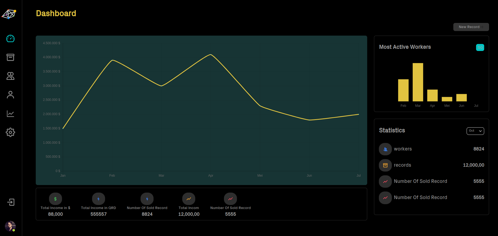

This project was bootstrapped with [Create React App](https://github.com/facebook/create-react-app).

## blockUi
a web-based application specifically (desktop screen only), with multi customized pages

## Technologies Used

 - HTML
 - CSS
 - JavaScript
 - ReactJS
 - Antd design
## Features

- Support two languages (English and Arabic)
- Simple UI
- Dark and light mode

## Usage
You can use this website to generate readme files in markdown language without actually writing in markdown ;).

## Code Examples
To run this project in your device, download the repository and open terminal in your editor and run command…
npm start
Open [http://localhost:3000](http://localhost:3000) to view it in the browser.

Or you can directly visit this link [https://blocksui.netlify.app/#/](https://blocksui.netlify.app/#/)

## Project Status

Not compeleted

## Improvements

- Adding functionality that allows users can create their own sections.
- Building A database can be introduced where user’s save/unsaved changes.

The page will reload if you make edits.
You will also see any lint errors in the console.

[Live link](https://blocksui.netlify.app/#/)
## Screenshots

 
